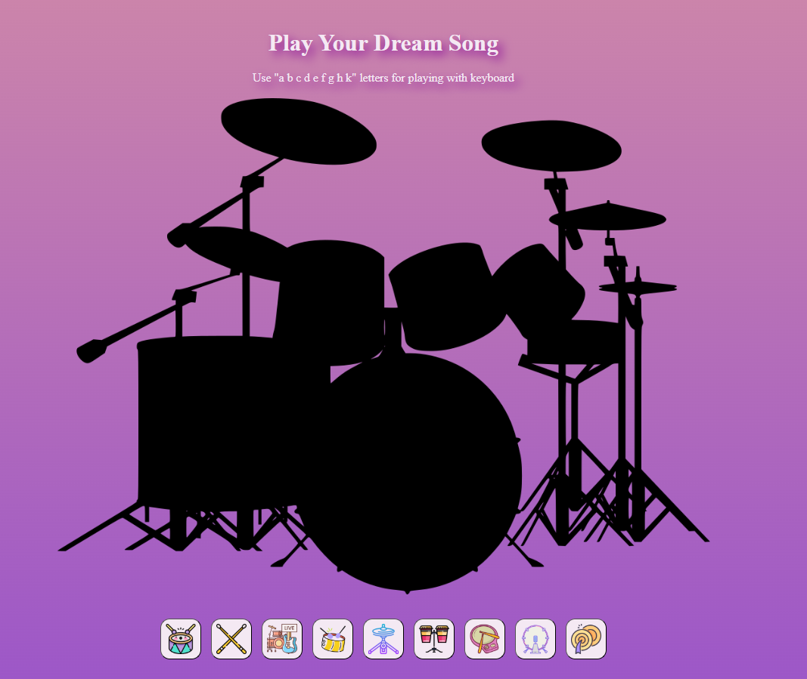

# Drum Kit Project

## 🎵 Overview

The Drum Kit is a simple web-based drum machine that allows users to play drum sounds using either keyboard keys or on-screen buttons. This project is built using HTML, CSS, and JavaScript.

## 🛠 Technologies Used

HTML: Structure of the web page

CSS: Styling and layout

JavaScript: Handles event listeners and audio playback

## 🎹 How to Play

You can interact with the drum kit in two ways:

Using Keyboard Keys:

Press A, B, C, D, E, F, G, H, or K to play corresponding drum sounds.

Clicking Drum Buttons:

Click on the drum images to play different sounds.

## 📝 Features

Interactive drum kit with sound effects

Responsive design with hover effects

Plays sounds on both click and keyboard input

Smooth animations on button hover

Enjoy playing your virtual drum kit! 🥁🎶

## Canlı Site

[Proje Adı](https://github-rabiademirbag.github.io/drumKit)
